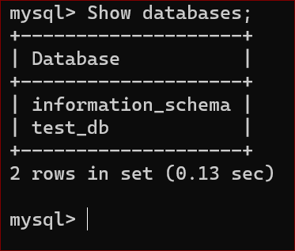

# CLIENT-SERVER ARCHITECTURE WITH MYSQL.

**.** Client-Server refers to an architecture in which two or more computers are connected together over a network to send and receive requests between one another.

**.** In their communication, each machine has its own role: the machine sending requests is usually referred as "Client" and the machine responding (serving) is called "Server".

**.** The task of this project is to implement a Client Server Architecture using MySQL Database Management System (DBMS).

**.** Create and configure two linux-based virtual servers (EC2 instances in AWS) and connect.

**.** Server A name - 'MYSQL server', Server B name - 'MYSQL client'.

**.** On MYSQL server, install MYSQL Server software  `sudo apt update -y`  `sudo apt install mysql-server -y`

**.** Enable the service `sudo systemctl enable mysql`

**.** On MYSQL client install MySQL Client software `sudo apt update -y` `sudo apt install mysql-client -y`

**.** Update the inbound rules in MYSQL server, by adding TCP port 3306. For extra security allow access only to private IP address of MYSQL client.

**.** Create a remote user, database, grant all privileges on the database and flush privileges. 

**.** Exit mysql.

**.** User and database have been created.

**.** Configure MYSQL server to allow connections from remote hosts `sudo vi /etc/mysql/mysql.conf.d/mysqld.cnf`

**.** Replace ‘127.0.0.1’ to ‘0.0.0.0’ in the bind-address

**.** Restart mysql `sudo systemctl restart mysql`.

**.** From MYSQL client connect remotely to MYSQL server `sudo mysql -u remote_user -h 172.31.88.73 -p`

**.** Confirm successful connection to the remote MySQL server by performing any SQL query: `Show database;`

**.** The screenshot below shows a fully functional MYSQL Client-Server set up.
